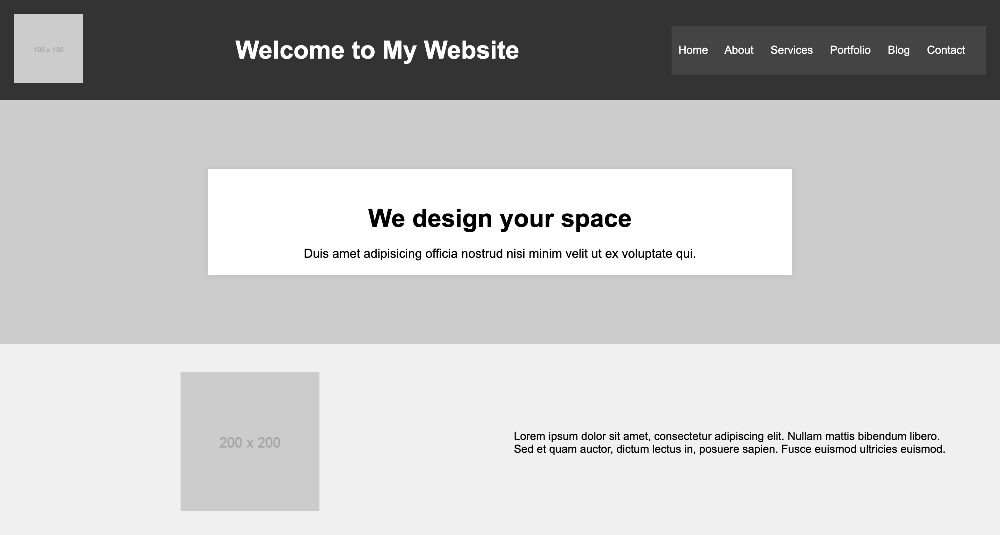

# Simple Website

Create a simple website for a fictional design company. The website should include the following elements:

## Header
- A logo image that links to the company's website.
  - 
- A navigation menu with the following items:
  - Home
  - About
  - Services (with a submenu)
    - Service 1
    - Service 2
    - Service 3
  - Portfolio
  - Blog
  - Contact

## Main Content
- A visually appealing background image.
- 
- A title with the text "We design your space" (font size 36px).
- A subtitle with the text "Duis amet adipisicing officia nostrud nisi minim velit ut ex voluptate qui" (font size 18px).
- Below the title and subtitle, 3 sections with two columns layout and class `two-column`.

**Column 1:**
  - 

**Column 2:**
- Text for Column 2:
  - **Paragraph 1:**
    - Aenean sit amet metus id erat rhoncus cursus eu eget purus.
  - **Paragraph 2:**
    - Quisque nec odio nec purus convallis facilisis id ac nisl.

**Column 3:**
  - 

**Column 4:**
- Text for Column 4:
  - **Paragraph 1:**
    - Vestibulum at nunc vitae dui dictum eleifend a in nunc.
  - **Paragraph 2:**
    - Aliquam erat volutpat. Phasellus ac posuere orci. Vivamus id tincidunt.

**Column 5:**
  - 

**Column 6:**
- Text for Column 6:
  - **Paragraph 1:**
    - Morbi quis orci nunc. Nunc iaculis risus et condimentum venenatis.
  - **Paragraph 2:**
    - Nulla facilisi. Maecenas bibendum odio in neque ultricies, sed suscipit elit bibendum.

## Footer
- A simple footer with a copyright symbol and the text "© 2023 Your Company Name."

## Responsivenetss
The web site gets tested on the following resolutions
- 1440x900
- 1366x768
- 480x800
